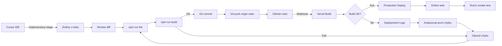

# Deployment Flow Diagram

Tok od vývoje po online aplikaci.

## Kroky v praxi

| # | Krok | Kdo |
|---|------|-----|
| 1 | Implementace v Cursoru (Agent mode) | Rodič + AI |
| 2 | Review diff | Rodič / Ask mode |
| 3 | `npm run lint && npm run build` | Rodič / terminál |
| 4 | Git commit | Rodič |
| 5 | Git push do main | Rodič |
| 6 | Vercel automatický build | Vercel |
| 7 | Smoke test na produkční URL | Rodič + dcera |

## Při chybě

1. Otevřít Vercel deployment logs
2. Najít **první** skutečnou chybu
3. Opravit lokálně
4. Ověřit lint + build
5. Commit + push

Viz [DEPLOYMENT.md](../DEPLOYMENT.md)
