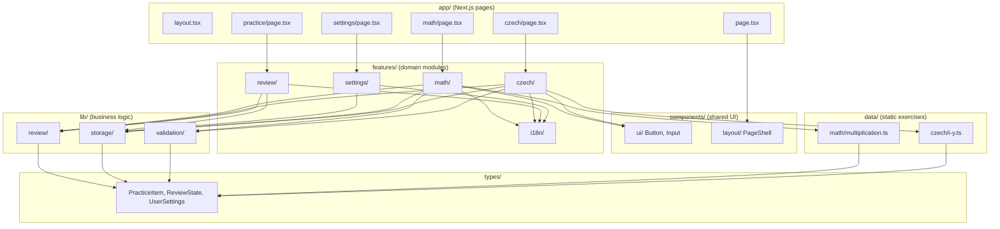

# Module Architecture Diagram

Struktura modulů a jejich vztahy.



## Pravidla závislostí

| Modul | Smí importovat z | Nesmí importovat z |
|-------|------------------|---------------------|
| `app/` | `components/`, `features/` | `lib/` přímo (přes features) |
| `components/` | `types/` | `features/`, `lib/`, `data/` |
| `features/` | `components/`, `lib/`, `types/`, `data/` | jiné features (minimálně) |
| `lib/` | `types/` | `features/`, `components/`, `app/` |
| `data/` | `types/` | `lib/`, `features/` |
| `types/` | – | vše ostatní |

## Tok dat

```
data/ → features/ → lib/validation → lib/review → lib/storage → localStorage
                  ↓
              components/ (feedback UI)
```

Viz [ARCHITECTURE.md](../ARCHITECTURE.md)
