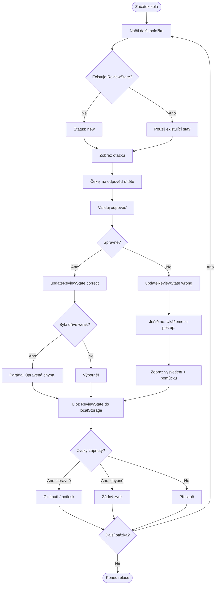

# Practice Flow Diagram

Detailní tok jednoho procvičovacího kola (matematika i čeština).

## Kroky v kódu

| Krok | Vrstva |
|------|--------|
| Načti položku | `lib/review/selectors.ts` |
| Zobraz otázku | `features/math/` nebo `features/czech/` |
| Validuj odpověď | `lib/validation/` |
| Aktualizuj stav | `lib/review/algorithm.ts` |
| Ulož stav | `lib/storage/reviewState.ts` |
| Zobraz feedback | UI komponenta |
| Přehraj zvuk | `features/settings/` (client only) |

## Pravidlo

Logika (validace, review, storage) **nikdy** přímo v UI komponentě.
