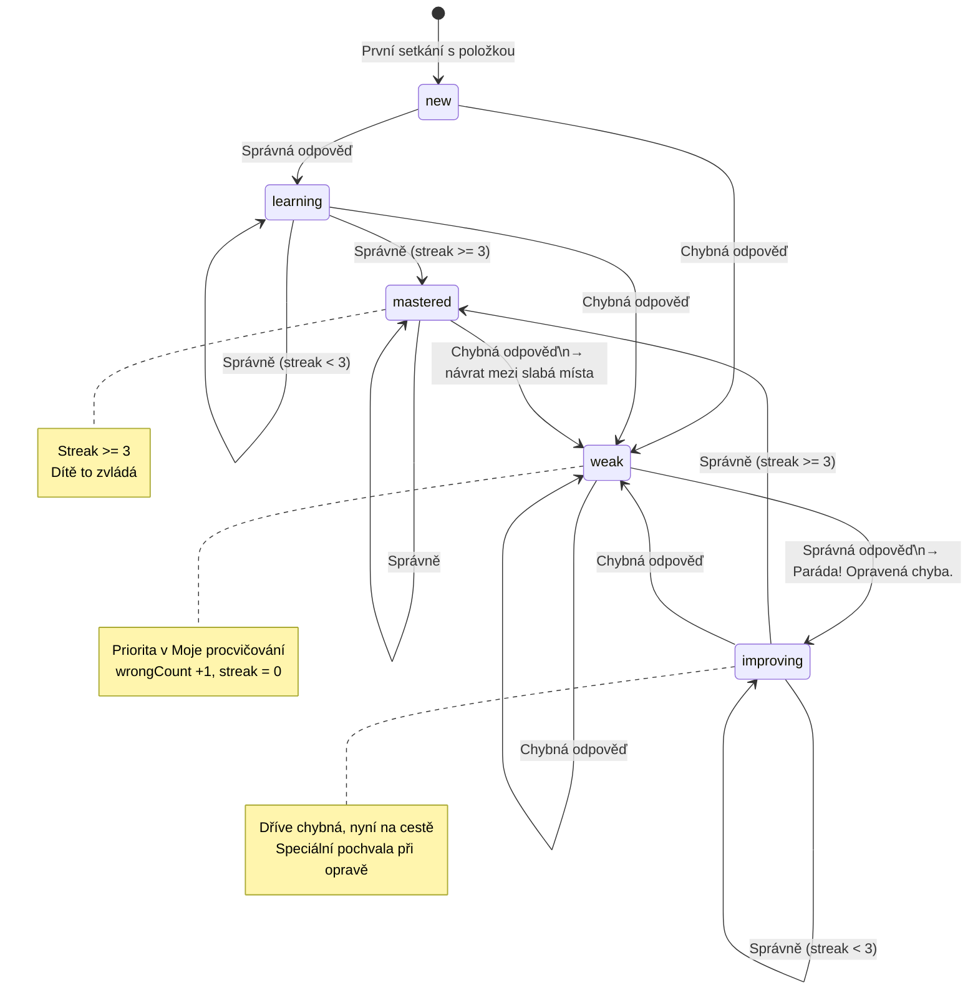

# Review State Machine

Stavy a přechody položky v systému chytrého opakování.

## Přechodová pravidla

| Z | Událost | Do | Akce |
|---|---------|-----|------|
| * | První zobrazení | new | – |
| new | correct | learning | correctCount+1, streak+1 |
| new | wrong | weak | wrongCount+1, streak=0 |
| learning | correct (streak<3) | learning | streak+1 |
| learning | correct (streak≥3) | mastered | streak+1, reviewStep+1 |
| learning | wrong | weak | wrongCount+1, streak=0 |
| weak | correct | improving | „Paráda! Opravená chyba." |
| weak | wrong | weak | wrongCount+1 |
| improving | correct (streak≥3) | mastered | reviewStep+1 |
| improving | wrong | weak | streak=0 |
| mastered | wrong | weak | Návrat mezi slabá místa |

## Implementace

Viz [REVIEW_ALGORITHM.md](../REVIEW_ALGORITHM.md) – `lib/review/algorithm.ts`
