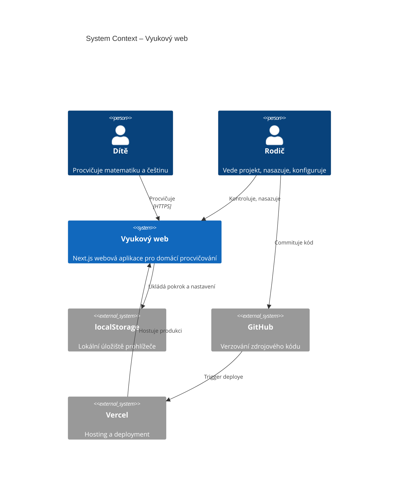

# System Context Diagram

Přehled systému a externích entit.

## Popis entit

| Entita | Role |
|--------|------|
| Dítě | Hlavní uživatel – procvičuje, odpovídá, opakuje chyby |
| Rodič | Vede projekt v Cursoru, pushuje na GitHub, sleduje deploy |
| Vyukový web | Next.js aplikace – UI, logika, statická data |
| localStorage | Lokální pokrok, review stavy, nastavení |
| GitHub | Zdrojový kód, verzování |
| Vercel | Production hosting, automatický build |

## Omezení MVP

- Žádná databáze
- Žádná registrace
- Žádné externí API
- Data jen v prohlížeči dítěte
