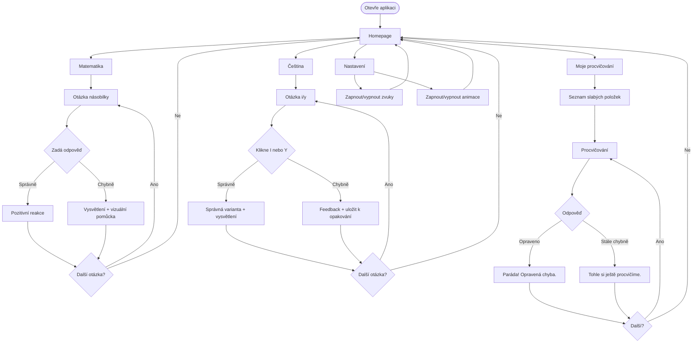

# User Flow Diagram

Hlavní uživatelské cesty dítěte v aplikaci.

## Klíčové větve

| Větev | Popis |
|-------|-------|
| Matematika | Input čísla → feedback → další otázka |
| Čeština | Klik I/Y → feedback → další otázka |
| Moje procvičování | Slabá místa → opakování → speciální pochvala |
| Nastavení | Zvuky a animace on/off |
